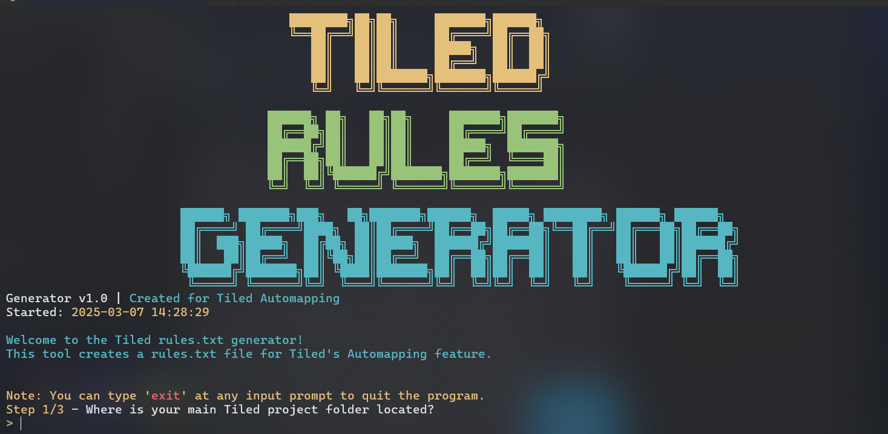

# Tiled Rules Generator


A command-line tool that automates the creation of `rules.txt` files for Tiled's Automapping feature. This tool scans your Tiled project folders and generates a properly formatted rules file to enable automapping across your project.

<p align="center">
  
</p>

## 🌟 Features

- 🔍 **Automatic TMX Scanning**: Recursively finds all .tmx files in specified folders
- 📝 **Rules.txt Generation**: Creates a properly formatted rules.txt file for Tiled Automapping
- 🚀 **User-Friendly Interface**: Colorful CLI with progress bars and visual feedback
- 🛠️ **Error Correction**: Allows modifying folder selections without restarting
- 🚪 **Exit Anytime**: Safely exit the program at any input prompt
- 🔄 **Progress Visualization**: Shows progress bars during file scanning
- 🎨 **Visual Styling**: Attractive ASCII art and colored terminal output

## 📋 Requirements

- Python 3.7 or newer
- Tiled Map Editor (https://www.mapeditor.org/)
- Terminal that supports ANSI color codes

## 🚀 Installation

1. Clone this repository:
   ```bash
   git clone https://github.com/username/tiled-rules-generator.git
   cd tiled-rules-generator
   ```

2. No additional dependencies are required - the script uses only Python standard libraries.

## 💻 Usage

Run the script from your terminal:

```bash
python rules.py
```

### Step-by-Step Instructions

1. **Start the application**
   - Run `python rules.py` to launch the Tiled Rules Generator
   - A colorful interface will guide you through the process

2. **Set your main project folder**
   - Enter the full path to your main Tiled project folder
   - This is the base directory where your rules.txt will reference files from

3. **Select rule folders to scan**
   - Specify how many folders containing rule files (.tmx) you want to include
   - Enter each folder path (relative to your main project folder)
   - The tool will validate each folder exists

4. **Review and modify folder selections**
   - After entering all folders, you'll see a summary list
   - You can change any folder by selecting its number
   - This allows fixing mistakes without restarting the program

5. **Scanning and file generation**
   - The tool will recursively scan all selected folders for .tmx files
   - A progress bar shows the scanning status
   - After confirmation, it will generate the rules.txt file

6. **Place the generated file**
   - Move the generated rules.txt file to your Tiled project folder
   - Enable Automapping in Tiled to start using your rules

### Tips

- Type `exit` at any input prompt to safely quit the program
- Relative paths are automatically calculated from your main project folder
- You can skip invalid folders if needed

## 📖 What is Tiled Automapping?

Tiled Automapping is a powerful feature in the Tiled Map Editor that allows automatic placement of tiles based on predefined rules. This helps speed up map creation and ensures consistency in your tile maps.

The `rules.txt` file tells Tiled which .tmx files contain the automapping rules. Manually creating this file can be tedious, especially for large projects with many rule files across multiple folders.

## 🤔 Common Issues

- **Colors not displaying**: Make sure your terminal supports ANSI color codes
- **Path errors**: Use absolute paths if relative paths aren't working
- **Rules not working in Tiled**: Ensure the rules.txt file is placed in the correct location

## 📄 License

This project is licensed under the MIT License - see the LICENSE file for details.

## 🙏 Acknowledgments

- [Tiled Map Editor](https://www.mapeditor.org/) - The amazing tile map editor
- The Tiled community for their support and resources

## 🔄 Contributing

Contributions are welcome! Please feel free to submit a Pull Request.

1. Fork the repository
2. Create your feature branch (`git checkout -b feature/amazing-feature`)
3. Commit your changes (`git commit -m 'Add some amazing feature'`)
4. Push to the branch (`git push origin feature/amazing-feature`)
5. Open a Pull Request

---

<p align="center">
  <i>Happy mapping with Tiled Rules Generator!</i>
</p>
